<div align="center">


# Jacky Gadhavi

### Full Stack Web Developer in Progress • Building in Public • India 🇮🇳

Currently learning through **Angela Yu's Complete Full-Stack Web Development Bootcamp** and documenting every project on GitHub.

</div>

---


I'm currently focused on becoming a **professional Full Stack Web Developer**.

My goal is simple:

- Learn by building.
- Push every project to GitHub.
- Improve every day.
- Land my first developer job.

---


### Currently Learning

```
HTML  ██████████ 100%
CSS   ███████░░░ 70%
JS    ░░░░░░░░░░ 0%
React ░░░░░░░░░░ 0%
Node  ░░░░░░░░░░ 0%
```

### Technologies

<p>

</p>

### Coming Soon

<p>

</p>

---


| Project | Status |
|---------|--------|
| Course Exercises | 🚧 In Progress |
| Portfolio Website | ⏳ Planned |
| Todo App | ⏳ Planned |
| Blog Website | ⏳ Planned |
| E-Commerce Website | ⏳ Planned |

---


<br>


<br>


<br>



---


Everything on this profile is generated from my own repository.

- Custom ASCII portrait
- Self-generated GitHub statistics
- SVG animations
- GitHub Actions automation
- No third-party stats services

---

<div align="center">

### Current Focus

🎯 Finish Angela Yu's Full Stack Bootcamp

🚀 Build real-world projects

💼 Become a professional Full Stack Developer

</div>