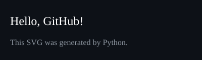

  

# Hi, I'm Jacky 👋

Welcome to my GitHub profile!

I'm currently learning Full Stack Web Development through Angela Yu's course.

## Current Goals
- Complete the course
- Build real-world projects
- Learn Git & GitHub
- Get my first tech job

---
## 📚 Learning Journey

### Course
- Angela Yu – The Complete Full-Stack Web Development Bootcamp

### Current Progress
- ✅ HTML
- ✅ Intermediate HTML
- ✅ CSS Basics
- ✅ CSS Box Model
- ✅ CSS Display
- 🔄 CSS Float (Current)

### Next Up
- Flexbox
- Grid
- Bootstrap
- JavaScript
- DOM
- Node.js
- Express
- React
- PostgreSQL